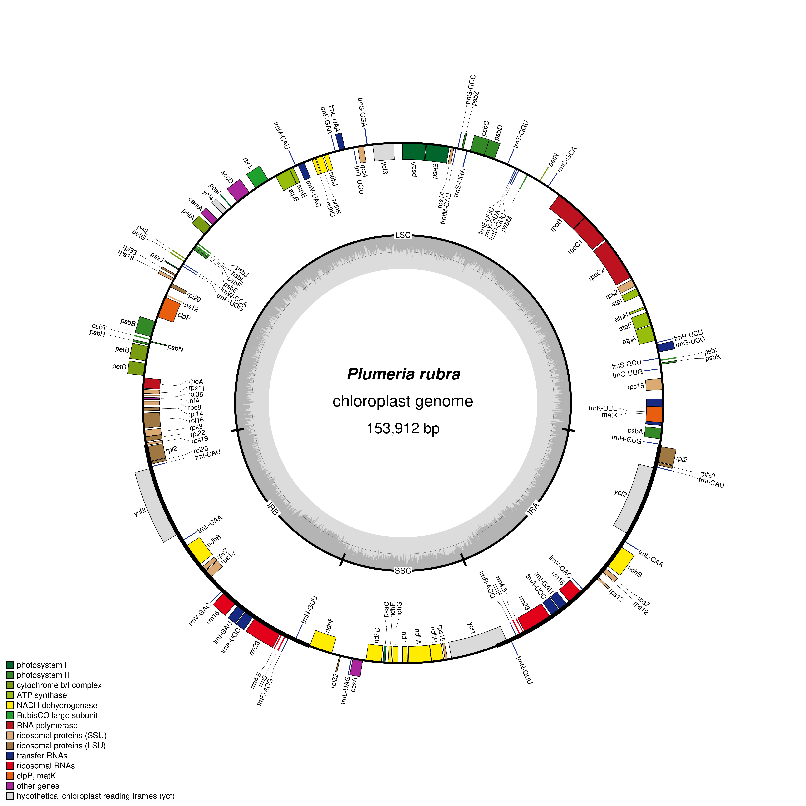

# Visualize Plastid Genome Structure

**Name:** Rica Jane Torres

**Scientific name of plant:** *Plumeria rubra* cultivar *Acutifolia*

**NCBI accession number:** MN812495.1

**Plastid genome length:** 153,912 bp

## Source of the genome file
https://www.ncbi.nlm.nih.gov/nuccore/MN812495.1

## Software used
OGDRAW: https://chlorobox.mpimp-golm.mpg.de/OGDraw.html

## A short description of the OGDRAW settings used
- Standard map mode, circular genome map, Plastid sequence source, automatic inverted-repeat detection, GC content graph, transcription direction, and full legend were used. The map was saved as a PNG file.

## The plastid genome map displayed in the README

*Figure 1.* Circular plastid genome map of *Plumeria rubra* cultivar *Acutifolia* generated using OGDRAW, showing gene organization, transcription direction, inverted repeat regions, and GC content.

## A short paragraph describing the main structural features observed in your plastid genome
- The *Plumeria rubra* chloroplast genome is a circular DNA molecule with a length of 153,912 bp. It contains four main regions: the large single-copy (LSC) region, small single-copy (SSC) region, and two inverted repeat regions (IRa and IRb). The map shows genes involved in photosynthesis, energy production, transcription, and protein synthesis. It also shows the direction of transcription and the GC content across the genome.

## A link to or location of your Lab_plastid_genome_answers.md file
https://github.com/torresricajane/cmb-plastid-genome--plumeria---torres-/blob/main/Lab_Plastid_Genome_Visualization/Answer/Lab_plastid_genome_answers.md
